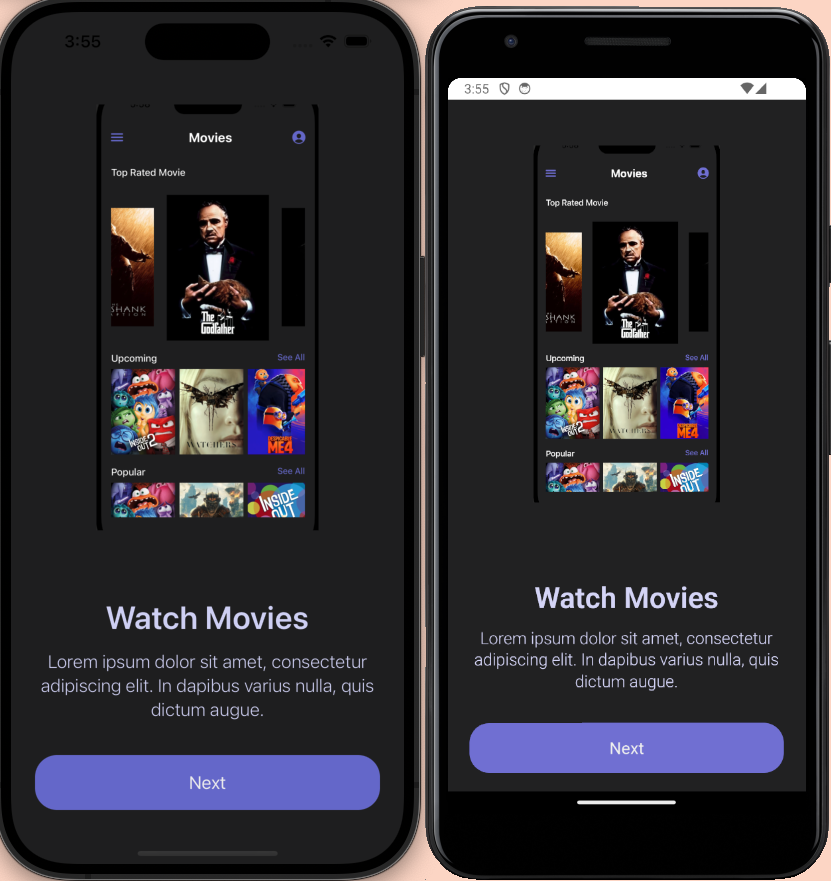
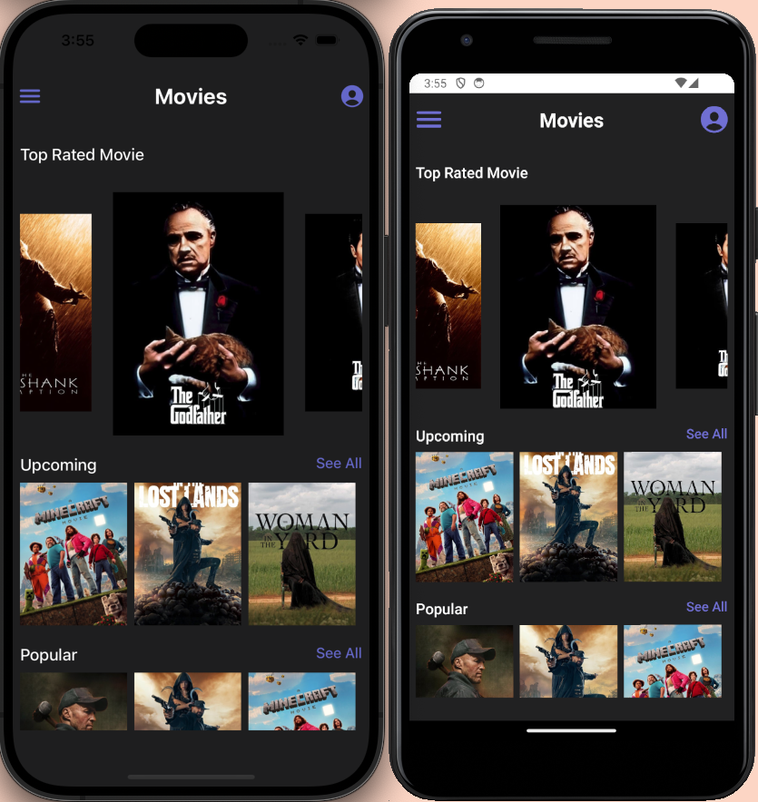
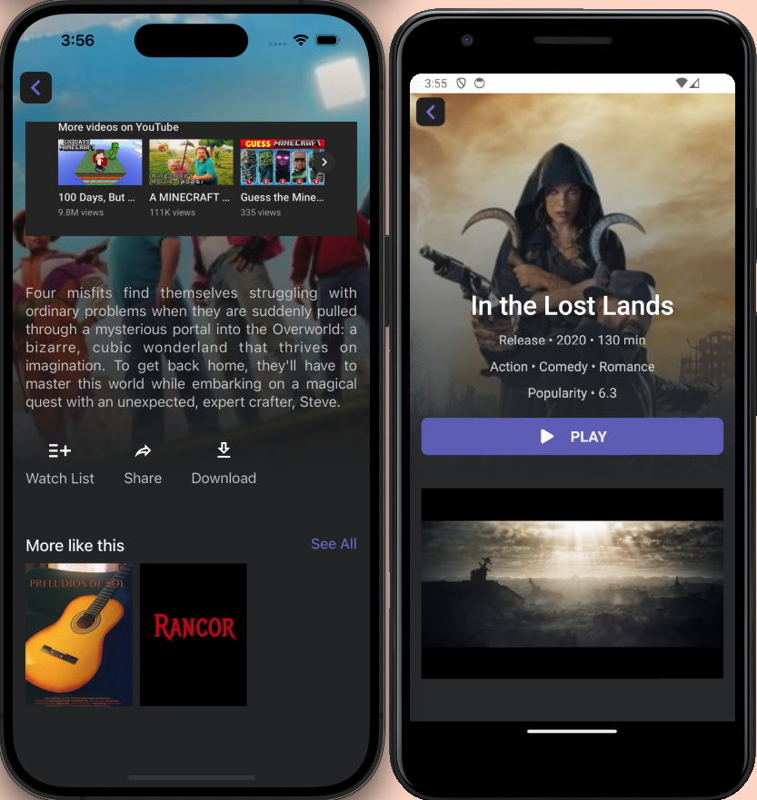

# 🎬 Welcome to the Expo Movie App 👋

This is an [Expo](https://expo.dev) project bootstrapped with [`create-expo-app`](https://www.npmjs.com/package/create-expo-app). It showcases movie browsing functionality powered by the TMDb API, along with seamless screen navigation using Expo Router.

## 🖼️ Screenshots & Demo






---

## 🚀 Getting Started

1. **Install dependencies**

   ```bash
   npm install
   ```

2. **Start the app**

   ```bash
   npx expo start
   ```

You’ll be prompted with options to run the app in:

- A [development build](https://docs.expo.dev/develop/development-builds/introduction/)
- An [Android emulator](https://docs.expo.dev/workflow/android-studio-emulator/)
- An [iOS simulator](https://docs.expo.dev/workflow/ios-simulator/)
- [Expo Go](https://expo.dev/go) — a lightweight way to preview your app on real devices

The project uses [file-based routing](https://docs.expo.dev/router/introduction/), so you can start building screens directly within the `app` directory.

---

## 🧭 Movie Browsing & Navigation

The app utilizes **React Navigation** and **Expo Router** for managing screen transitions. Here's how it's structured:

- **Main Screen (`/index`)**  
  Serves as a splash or landing screen. It provides a welcoming branded interface and acts as a brief introduction before users enter the main app.

- **Home Screen (`/homescreen`)**  
  Fetches and displays movie categories like **Top Rated**, **Upcoming**, and **Popular** using the TMDb API.

- **Movie Details Screen (`/details/[id]`)**  
  Tapping a movie navigates to a dynamic route displaying detailed information, including:
  - Movie overview
  - YouTube trailer
  - Similar movies
  - And more…

- **Navigation**  
  All routing is handled through Expo Router’s file-based system, which keeps navigation scalable and intuitive.

- **Theming & Styling**  
  The app includes a centralized constants file for consistent design and layout throughout the app. It contains:
  - `SIZES` – for standardized spacing, padding, and dimensions
  - `FONTS` – for reusable typography styles
  - `COLORS` – for maintaining a unified color palette

---

## 🧠 Decisions, Challenges & Known Issues

- **API Integration**  
  The [TMDb API](https://developer.themoviedb.org/) was selected for its rich content and ease of use. Data fetching is handled with **Axios** and custom hooks.

- **Routing Strategy**  
  **Expo Router** was chosen for its simplicity and tight integration with the project structure, making screen navigation feel seamless and organized.

- **Responsive Design Challenge**  
  Styling movie cards across various screen sizes required careful tuning with Flexbox and percentage-based dimensions.

- **Known Issue**  
  Video trailers do not play on **iOS** when using the Expo Go app due to platform restrictions on embedded web content (like YouTube players). However, building a **development build** or **production build** of the app resolves this issue, and video playback functions as expected.

---

## 🔐 Environment Variables

This project uses environment variables to securely manage sensitive data like API keys.

### 📁 Setup Instructions

**Create an `.env` file** in the root of your project (next to `package.json`):

   ```env
   EXPO_PUBLIC_TMDB_AUTH_KEY=your_tmdb_api_key_here
   ```

---

## 🔄 Reset to a Fresh Project

If you want to start from scratch:

```bash
npm run reset-project
```

This will archive the starter code in the `app-example` directory and generate a fresh `app` directory for development.

---

## 📚 Learn More

- [📖 Expo Documentation](https://docs.expo.dev/)
- [🚀 Expo Router Intro](https://docs.expo.dev/router/introduction/)
- [🎥 TMDb API Docs](https://developer.themoviedb.org/docs)

---

## 💬 Join the Community

- [GitHub – Expo](https://github.com/expo/expo)
- [Expo Discord](https://chat.expo.dev)

---

Let me know if you want to add screenshots, demo videos, or a features section — those can make your README really stand out!
